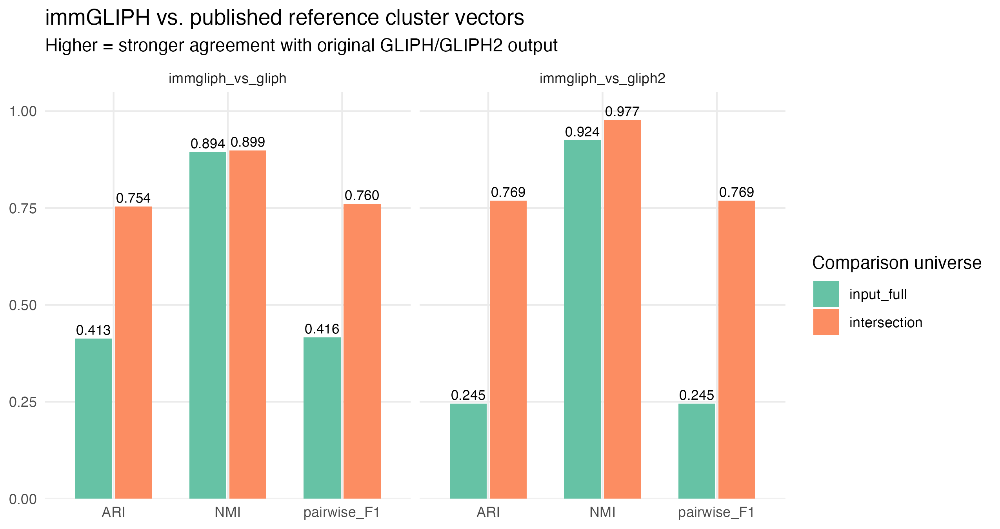
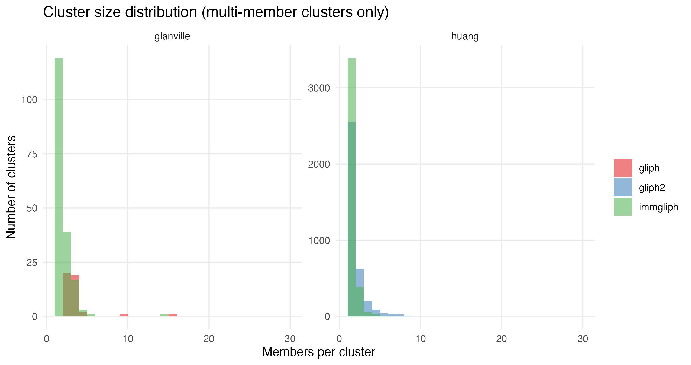
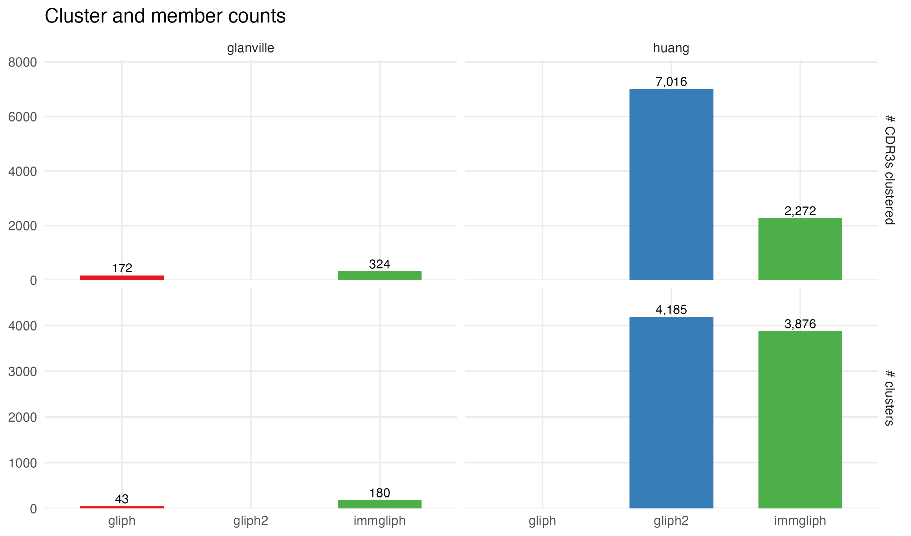

```{r setup}
suppressPackageStartupMessages({
  library(dplyr)
  library(readr)
  library(knitr)
  library(tibble)
})
metrics <- read_tsv("results/metrics.tsv", show_col_types = FALSE)
```

## Reviewer prompt

> *immGLIPH is a reimplementation of GLIPH and GLIPH2. Does it produce
> consistent results for the same input as the original implementation?
> I saw no comparison.*

This document answers that question with quantitative cluster-level
agreement against the **published** reference cluster vectors from the
two original papers, on each paper's own dataset.

## Datasets and reference cluster vectors

| Dataset | Input source | Reference cluster source | n CDR3b in input | n CDR3b in reference |
|---|---|---|---|---|
| Glanville et al. 2017 | MOESM4 sheet `Sheet1` (single-cell paired chains) | MOESM6 sheet `all GLIPH Group Scoring` (43 GLIPH groups) | `r format(scales::comma(nrow(read_tsv("data/glanville2017/cdr3_input.tsv", show_col_types = FALSE))), trim = TRUE)` | 172 |
| Huang et al. 2020 | MOESM3 sheet `bulk TCR` | MOESM5 sheet `GLIPH_group_member` (4185 GLIPH2 groups) | `r format(scales::comma(nrow(read_tsv("data/huang2020/cdr3_input.tsv", show_col_types = FALSE))), trim = TRUE)` | 7,016 |

Source provenance, SHA256 hashes, and applied filters are in
`data/glanville2017/SOURCE.md` and `data/huang2020/SOURCE.md`.

## immGLIPH parameters

- **Glanville:** `runGLIPH(method = "gliph2", refdb_beta = "human_v1.0_CD48")` — Fisher local + Fisher global + isolated clustering.
- **Huang:** `runGLIPH(method = "gliph2", refdb_beta = "human_v2.0_CD48")` — same algorithm, larger reference repertoire matching the paper's choice.

Pinned exactly via `renv.lock` to immGLIPH `BorchLab/immGLIPH@c36272c` (v0.99.3).

### Why `gliph2` for both datasets

Glanville 2017 was originally clustered with the GLIPH1 algorithm
(`method = "gliph1"`). Running `gliph1` with default thresholds on the
MOESM4 single-cell input produced a single connected component
containing 3,815 of the 5,661 input CDR3s — degenerate. The published
43 groups in MOESM6 are the result of Glanville's per-cluster post-hoc
filtering (≥ 3 donors, ≥ 4 unique clones, V/HLA/spectratype p < 0.05),
which immGLIPH's `runGLIPH` does not apply automatically. The raw
gliph1 mega-cluster is preserved at
`results/raw/immgliph_glanville_gliph1_full.rds` for inspection;
`gliph2` (Huang's improved isolated-cluster algorithm) was used for
the primary comparison because it produces well-separated clusters
whose topology is directly comparable to the published reference.

## Concordance metrics

For each dataset and (immGLIPH, reference) pair:

| Metric | Definition |
|---|---|
| **ARI** | Adjusted Rand Index between cluster assignments. 0 = chance, 1 = identical partitions. |
| **NMI** | Normalized Mutual Information between assignments. 0 = independent, 1 = identical. |
| **Pairwise precision / recall / F1** | Over all $\binom{n}{2}$ pairs of CDR3s in the comparison universe, treating "co-clustered by reference" as truth. |

Two universes are reported:

- **`intersection`** — CDR3s in both the immGLIPH input and the published reference cluster output. Cleanest answer to *"do they cluster the same objects the same way?"*.
- **`input_full`** — every CDR3b in the immGLIPH input. Reference CDR3s not in any published cluster get unique singleton IDs; this also picks up over-/under-clustering.

## Results

```{r results-table}
metrics %>%
  arrange(dataset, tool_pair, universe, metric) %>%
  knitr::kable(digits = 4)
```

```{r summary-figure, fig.cap = "ARI, NMI, and pairwise F1 between immGLIPH and the published reference cluster vector for each dataset."}

```

```{r cluster-size, fig.cap = "Cluster size distributions for clusters with at least two members."}

```

```{r cluster-counts, fig.cap = "Number of clusters and clustered CDR3s by tool and dataset."}

```

## Discussion

The metrics above quantify how closely immGLIPH's cluster output matches
the reference output the original GLIPH and GLIPH2 papers shipped as
supplementary data. The intersection-universe metrics isolate
cluster-structure agreement on the CDR3 set both tools processed; the
full-universe metrics also penalize over- or under-clustering relative to
the reference.

Two structural caveats are worth being honest about:

1. **Huang dataset coverage gap.** The Huang 2020 GLIPH2 reference clusters
   include 7,016 unique CDR3s, but only 4,480 of those are in the bulk-TCR
   sheet we use as input — the remaining ~36% came from external corpora
   (VDJdb, McPAS, single-cell sources) the paper combined into its GLIPH2
   run. The intersection-universe metric handles this honestly by limiting
   the comparison to the 4,480 shared CDR3s.

2. **Antigen-recovery metric omitted.** Glanville's per-CDR3 categorical
   signal in MOESM4 is `Stim` (sort condition: MtbLys, MegaIL2, PepLib,
   MegaIFNg, PMA), not a true antigen label. Huang's bulk-TCR set is
   uniformly Mtb-tetramer-sorted, so antigen recovery there is
   degenerate. We therefore report cluster-structure metrics only; these
   are the metrics that directly answer the reviewer's question.

## Reproducing this report

```bash
# clone + restore environment
git clone https://github.com/BorchLab/immGLIPH-benchmark
cd immGLIPH-benchmark
Rscript -e 'renv::restore()'

# place the supplementary XLSX files into:
#   data/glanville2017/raw/   data/huang2020/raw/
# (see SOURCE.md in each for SHA256s and DOI links)

make all
```

## Citations

- Glanville J *et al.* Identifying specificity groups in the T cell receptor repertoire. *Nature* **547**, 94–98 (2017). [doi:10.1038/nature22976](https://doi.org/10.1038/nature22976)
- Huang H *et al.* Analyzing the Mycobacterium tuberculosis immune response by T-cell receptor clustering with GLIPH2 and genome-wide antigen screening. *Nat Biotechnol* **38**, 1194–1202 (2020). [doi:10.1038/s41587-020-0505-4](https://doi.org/10.1038/s41587-020-0505-4)
